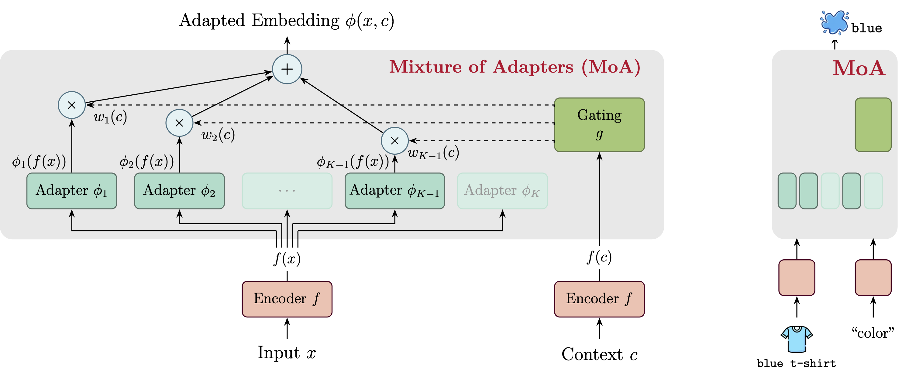

# Mixture of Adapters: Context-Aware Adaptation of Representations

This repo contains code for reproducing the experiments in our paper and using our proposed architecture. 

**Fig. 1:** The left diagram shows the proposed Mixture of Adapters (MoA) architecture for generating context-aware embeddings $\phi(x, c)$. The input $x$ is encoded and processed by $K$ adapters in parallel. The context $c$ is independently encoded and used by a gating module to compute mixing weights, producing a weighted sum of adapter outputs as the final embedding. The right diagram shows an example: given the input "blue t-shirt" and the context "color," the model produces a context-aware embedding that emphasizes "blue," isolating the specified feature.

## Security

See [CONTRIBUTING](CONTRIBUTING.md#security-issue-notifications) for more information.

## License

This project is licensed under the Apache-2.0 License.
